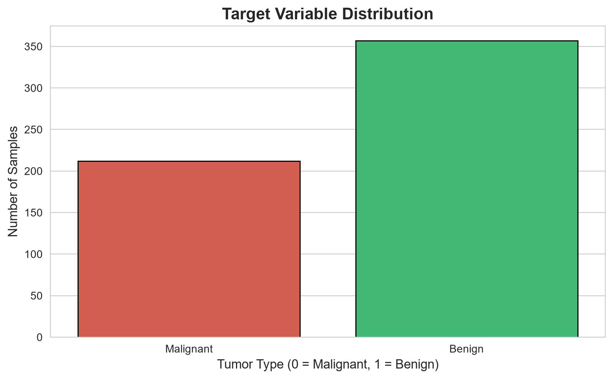
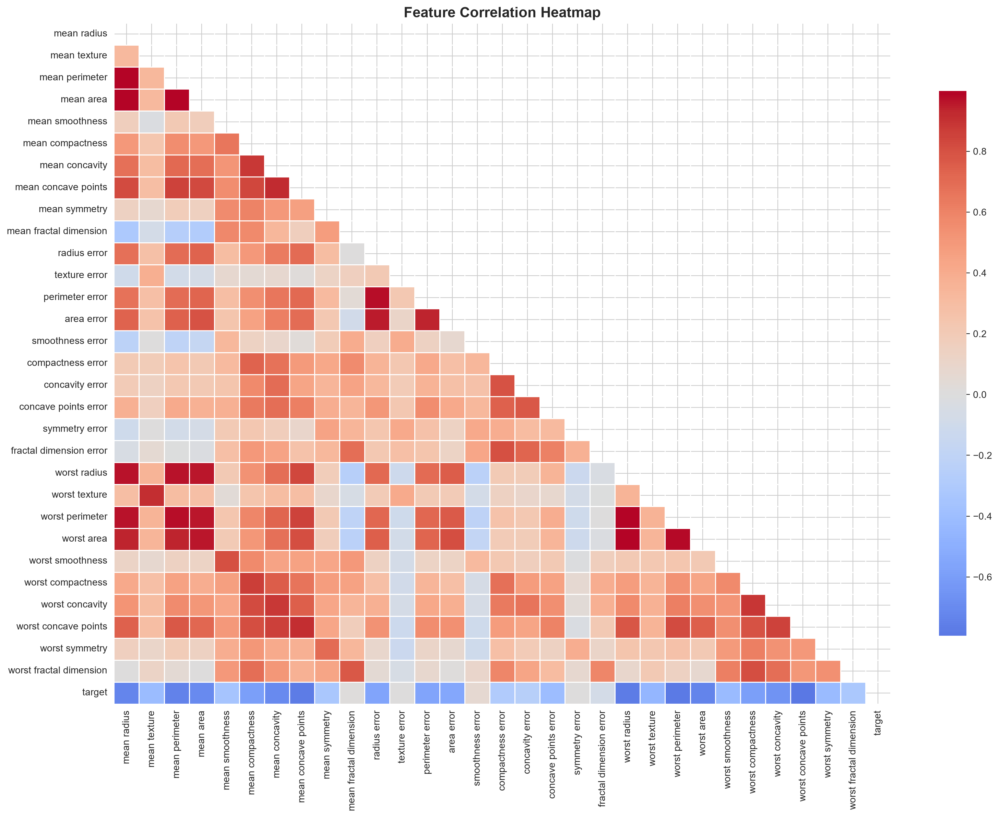
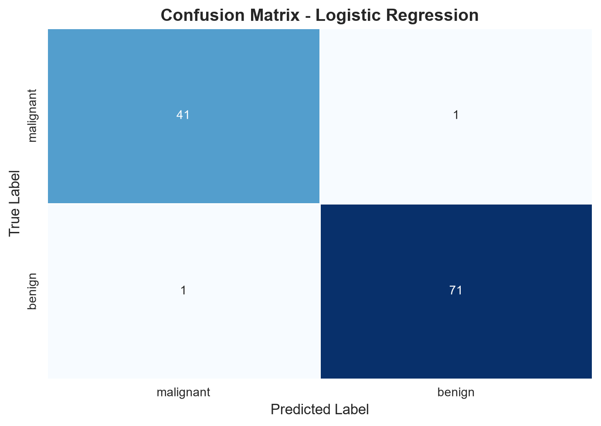

# 🩺 Breast Cancer Diagnostic System Using Machine Learning


---

## Internship Information

| Field              | Details                         |
| ------------------ | ------------------------------- |
| Internship Program | Machine Learning Internship     |
| Organization       | CodeTech IT Solutions Pvt. Ltd. |
| Intern Name        | Vijayaragavan U                 |
| Intern ID          | CITS5452                        |
| Duration           | 4 Weeks                         |
| Internship Period  | 18 June 2026 – 16 July 2026     |
| Domain             | Machine Learning                |
| Project            | Breast Cancer Diagnostic System |
| Project Type       | Healthcare Analytics            |

---

## 📖 Project Overview

The Breast Cancer Diagnostic System is a Machine Learning-based healthcare analytics project developed to classify breast tumors as either **Malignant (Cancerous)** or **Benign (Non-Cancerous)** using diagnostic measurements extracted from breast cancer cell nuclei.

Early detection of breast cancer plays a crucial role in improving treatment effectiveness and increasing survival rates. This project demonstrates how Machine Learning can assist healthcare professionals by providing accurate predictions based on medical diagnostic data.

The system analyzes multiple tumor characteristics and uses a trained Logistic Regression model to predict the likelihood of cancer.

---

## 🎯 Problem Statement

Breast cancer is one of the most common cancers affecting women worldwide. Traditional diagnosis requires extensive medical evaluation and expert analysis.

The objective of this project is to develop a Machine Learning model capable of:

* Predicting whether a tumor is malignant or benign.
* Assisting healthcare professionals in diagnosis.
* Improving decision-making through data-driven predictions.
* Demonstrating practical applications of Machine Learning in healthcare.

---

## 🚀 Project Objectives

* Load and explore medical diagnostic data.
* Perform statistical and exploratory data analysis.
* Visualize important data patterns.
* Train a classification model using Logistic Regression.
* Evaluate model performance using multiple metrics.
* Generate visual reports for analysis.
* Save the trained model for future predictions.

---

## 📊 Dataset Information

### Dataset Used

Breast Cancer Wisconsin Diagnostic Dataset

Source:

Scikit-Learn Built-in Dataset

### Dataset Statistics

| Attribute       | Value |
| --------------- | ----- |
| Total Records   | 569   |
| Features        | 30    |
| Target Classes  | 2     |
| Malignant Cases | 212   |
| Benign Cases    | 357   |

### Target Variable

| Value | Meaning                |
| ----- | ---------------------- |
| 0     | Malignant (Cancerous)  |
| 1     | Benign (Non-Cancerous) |

---

## 🛠️ Technologies Used

| Category             | Technology          |
| -------------------- | ------------------- |
| Programming Language | Python              |
| Data Processing      | Pandas, NumPy       |
| Data Visualization   | Matplotlib, Seaborn |
| Machine Learning     | Scikit-Learn        |
| Model Persistence    | Pickle              |
| IDE                  | Visual Studio Code  |
| Version Control      | Git & GitHub        |

---

## 🧠 Machine Learning Workflow

### 1. Dataset Loading

The dataset is loaded using Scikit-Learn and converted into a Pandas DataFrame.

### 2. Data Exploration

Performed:

* Dataset Shape Analysis
* Feature Inspection
* Data Type Analysis
* Statistical Summary

### 3. Missing Value Analysis

Verified dataset quality by checking for null values and inconsistencies.

### 4. Data Visualization

Generated:

* Target Distribution Plot
* Correlation Heatmap
* Confusion Matrix Heatmap

### 5. Feature Scaling

Used StandardScaler to normalize all features and improve model performance.

### 6. Train-Test Split

Dataset divided into:

* 80% Training Data
* 20% Testing Data

### 7. Model Training

Trained a Logistic Regression classification model.

### 8. Model Evaluation

Evaluated using:

* Accuracy Score
* Precision Score
* Recall Score
* F1 Score
* Confusion Matrix
* Classification Report

### 9. Model Saving

Saved the trained model using Pickle for future use.

---

## 🤖 Machine Learning Algorithm

### Logistic Regression

Logistic Regression is a supervised Machine Learning algorithm used for binary classification problems.

In this project, the algorithm predicts whether a tumor belongs to:

* Malignant Class
* Benign Class

based on diagnostic features.

Reasons for choosing Logistic Regression:

* Fast Training
* High Accuracy
* Easy Interpretation
* Suitable for Binary Classification

---

## 📈 Model Performance

### Evaluation Results

| Metric    | Score  |
| --------- | ------ |
| Accuracy  | 98.25% |
| Precision | 98.61% |
| Recall    | 98.61% |
| F1 Score  | 98.61% |

### Confusion Matrix

```text
[[41  1]
 [ 1 71]]
```

The model correctly classified almost all test samples with only two misclassifications.

---

## 📂 Project Structure

```text
CodeTech_Breast_Cancer_Diagnostic/
│
├── screenshots/
│   ├── distribution.png
│   ├── heatmap.png
│   └── confusion_matrix.png
│
├── outputs/
│   └── model_metrics.txt
│
├── breast_cancer.py
├── cancer_model.pkl
├── dataset_info.txt
├── requirements.txt
└── README.md
```

---

## ⚙️ Installation Guide

### Step 1: Clone Repository

```bash
git clone https://github.com/vijayaragavan-dev/CodeTech_Breast_Cancer_Diagnostic.git
```

### Step 2: Navigate to Project Directory

```bash
cd CodeTech_Breast_Cancer_Diagnostic
```

### Step 3: Install Required Libraries

```bash
pip install -r requirements.txt
```

### Step 4: Run the Project

```bash
python breast_cancer.py
```

---

## 📌 Outputs Generated

### Model File

```text
cancer_model.pkl
```

### Reports

```text
dataset_info.txt
outputs/model_metrics.txt
```

### Visualizations

```text
screenshots/distribution.png
screenshots/heatmap.png
screenshots/confusion_matrix.png
```

---

## 📷 Project Visualizations

### Target Distribution



### Correlation Heatmap



### Confusion Matrix



---

## 📚 Learning Outcomes

Through this project, I gained practical experience in:

* Healthcare Data Analysis
* Data Visualization
* Statistical Analysis
* Feature Scaling
* Machine Learning Classification
* Logistic Regression
* Model Evaluation
* Model Persistence
* Technical Documentation
* GitHub Project Management

---

## 🔮 Future Enhancements

* Random Forest Implementation
* Support Vector Machine (SVM)
* ROC Curve Analysis
* Hyperparameter Tuning
* Streamlit Web Application
* Real-Time Cancer Prediction Interface

---

## 👨‍💻 Author

### Vijayaragavan U

Bachelor of Engineering (B.E.) – Computer Science and Engineering

Saranathan College of Engineering

Tiruchirappalli, Tamil Nadu, India

### Internship Details

* Organization: CodeTech IT Solutions Pvt. Ltd.
* Internship Domain: Machine Learning
* Intern ID: CITS4915
* Duration: 4 Weeks

### Connect With Me

* GitHub: https://github.com/vijayaragavan-dev
* LinkedIn: https://www.linkedin.com/in/vijaya-ragavan-ki10052007
* Portfolio: https://vijayaragavan.vercel.app

---

### ⭐ If you found this project useful, consider giving it a star on GitHub.

**Submitted as part of the Machine Learning Internship at CodeTech IT Solutions Pvt. Ltd. (Intern ID: CITS4915).**
